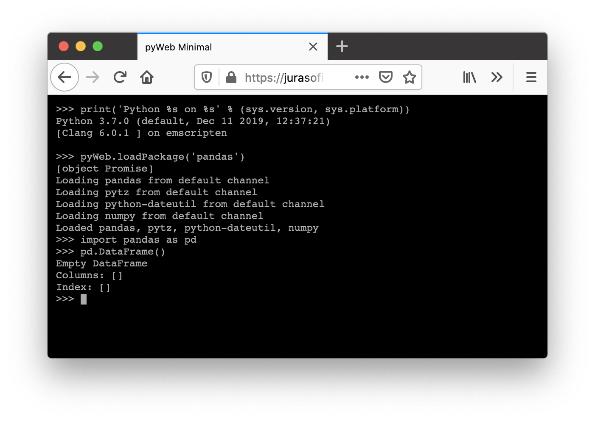

# pyWeb - CPython, Numpy & co. in the browser 

Check out the [Main demo.](https://jurasofish.github.io/pyweb/)

[](https://jurasofish.github.io/pyweb/)

pyWeb provides a terminal front-end for [Pyodide](https://github.com/iodide-project/pyodide), making it more accessible for developers and easing the creation of command line-based python web programs.
[Pyodide](https://github.com/iodide-project/pyodide) is the CPython scientific stack, compiled to WebAssembly - yes, CPython with numpy, pandas, etc. in the browser 100% client-side.

### Live Demos

 - [Overview](https://jurasofish.github.io/pyweb/)
 - [Loading packages (numpy, pandas, etc.)](https://jurasofish.github.io/pyweb/demos/loading_packages.html)
 - [Using matplotlib](https://jurasofish.github.io/pyweb/demos/plotting_matplotlib.html)
 - [Files and filesystem](https://jurasofish.github.io/pyweb/demos/filesystem.html)
 - [Minimal usage](https://jurasofish.github.io/pyweb/demos/minimal.html)

## Guide

### Getting Started

The master branch of this repository contains the latest version of pyWeb.js.

To use pyWeb load the prerequisite JavaScript libraries and call `pyWeb.new()`.

```html
<!-- Minial example - full screen pyWeb terminal. -->
<!doctype html>
<html>
  <head>
    <script src="https://cdn.jsdelivr.net/npm/jquery@3.4.1/dist/jquery.min.js"></script>
    <script src="https://cdn.jsdelivr.net/npm/jquery.terminal@2.12.0/js/jquery.terminal.min.js"></script>
    <link href="https://cdn.jsdelivr.net/npm/jquery.terminal@2.12.0/css/jquery.terminal.min.css" rel="stylesheet"/>
    <script src="https://pyodide.cdn.iodide.io/pyodide.js"></script>
    <script src="../pyWeb.js"></script>
    </head>
  <body>
    <script>
        pyWeb.new()
    </script>
  </body>
</html>
```

Or, to attach to an existing div specify it's name.

```html
<body>
    <div id="myPyWebTerminal"></div>
    <script>
        pyWeb.new('#myPyWebTerminal')
    </script>
</body>
```

In these examples - and the examples in this repository - Pyodide has been loaded from the iodide CDN. Pyodide is very large so you may wish to set up a more controlled CDN to ensure your site does not have performance issues.

### Running code

You can type code in the terminal and run it, of course.
The terminal is intended to vaguely mirror the PyCharm python console behaviour. 
It supports multi-line input if it detects an incomplete first line or if you use `shift+enter`. 
History is accesible with arrow keys. 
The terminal itself uses [jQuery Terminal Emulator](https://github.com/jcubic/jquery.terminal).

From JavaScript, use the `pyWeb.runCode()` function to execute code in the terminal.
Using the `options` argument you can control whether thd code itself and the output of the code are displayed in the terminal.
The returned object gives you access to the output produced by the executed code.
See the [Main demo](https://jurasofish.github.io/pyweb/) where this is bound
to a button.

```javascript
// Run code in pyWeb terminal from JavaScript.

// Simple:
pyWeb.runCode('print(1)')
    
// More complex
let exec_res = pyWeb.runCode(String.raw`
        a = 1
        print(a)
    `,
    {display_input: false}
)
console.log(exec_res.output)
// exec_res contains other useful info - see the API reference.
```

You can also use the Pyodide functions to run code, which do not interact with the pyWeb terminal. e.g. `pyodide.runPython()` (see the Pyodide docs).

### Loading packages

To import a package in pyWeb/Pyodide you first have to load its files into the virtual filesystem (unless it's part of the python standard library, which are already loaded). These files must already be compiled for Pyodide - luckily the Pyodide project has already done this for a heap of packages: [This will give you an idea of what's available.](https://github.com/iodide-project/pyodide/tree/master/packages)

To load package files, pyWeb provides the function `pyWeb.loadPackage(packageName)` which is a very light wrapper around `pyodide.loadPackage()`. 

This will load the files from the location specified when Pyodide was compiled. For example, if you loaded Pyodide from the iodide CDN then it's probably configured to load packages from the same location. You can use the browser's developer tools to see where it's loading packages from. Packages can be large - loading pandas and its prerequisites takes some 20MB of downloads. The CDN from which this is downloaded will have an effect on the loading time.

```python
>>> # Load the numpy package files.
>>> # This will load from wherever Pyodide was told at compile time.
>>> pyWeb.loadPackage('numpy')
>>> # The console will not allow any more input until the numpy files are loaded.
>>> # Now that the files are loaded, we can import numpy.
>>> import numpy as np
```

Because the `loadPackage` function is asynchronous (non-blocking), it will allow python code following it to be executed immediately, even though the package files haven't loaded yet. Always use the `loadPackage` function on its own input line.

```python
>>> # This will fail because the commands are executed together.
>>> pyWeb.loadPackage('numpy')
... import numpy as np
Traceback (most recent call last):
  File "<exec>", line 162, in _exec_buffer
  File "/lib/python3.7/site-packages/pyodide.py", line 43,
 in eval_code
    exec(compile(mod, '<exec>', mode='exec'), ns, ns)
  File "<exec>", line 2, in <module>
ModuleNotFoundError: No module named 'numpy'
>>> # Wait a few seconds for the files to finish loading in the background and it will probably work.
>>> import numpy as np
```

You can also load packages from JavaScript and make use of the returned promise to make sure files are loaded before running the next piece of code:

```javascript

// Load a package from JavaScript.
// Note here that the Pyodide.loadPackage promise is passed through
// from JavaScript to Python, and finally to Javascript where we use it.

pyWeb.new().then( () => {
    console.log('pyWeb loaded')
    pyWeb.runCode("pyWeb.loadPackage('numpy')").result.then( () => {
        console.log('numpy loaded');
        pyWeb.runPython('import numpy as np')
    })
})
```

To load a package without displaying anything in the pyWeb terminal you can just use the plain `pyodide.loadPackage()`:

```javascript
pyWeb.new().then( () => {
    pyodide.loadPackage('numpy').then( () => {
        console.log('numpy loaded silently');
    })
})
```

For installing pure Python packages from PyPI, Pyodide's `micropip` package works - see the Pyodide docs.
This is very experimental.
Note that `micropip.install` is aynchronous so you'll have to guess when it's finished. (Could make this block the terminal like `pyWeb.loadPackage` - TODO).

e.g. (copying the example from Pyodide)

```python
>>> pyWeb.loadPackage('micropip')
>>> import micropip
>>> micropip.install('snowballstemmer')  # async
>>> import snowballstemmer
>>> stemmer = snowballstemmer.stemmer('english')
>>> stemmer.stemWords('go goes going gone'.split())
['go', 'goe', 'go', 'gone']
```

## Tests

[Run the tests yourself here.](https://jurasofish.github.io/pyweb/tests/pyWebTestRunner.html)

Opening the test page will load Pyodide and run the tests locally in your
web browser using [Jasmine](https://jasmine.github.io/).

## Jank

There are plenty of things that aren't so pleasant in pyWeb.

 - Updating the text rendered in the terminal requires JavaScript to yield to the browser event loop.
 This isn't (trivially) possible from within python.
 As a result, Python's stdout and stderr will only be displayed once the running Python code finishes and hands control back to the browser.
 pyWeb has an option to also push stdout and stderr to the JavaScript console, which occurs in real time.

 - Similarly, there is no proper sleep function available yet.
   pyWeb includes a busy sleep function.

 - Working with files from your local filesystem is not yet easy.

 - The Pyodide CDN used in the demos on this repository is unversioned, and pyWeb doesn't check the Pyodide version yet.

## JavaScript API

pyWeb creates a single `pyWeb` global in javascript, along with the `pyodide` global.

### `pyWeb.new(div, [options])`
```
Initialize pyWeb/Pyodide and attach terminal to the specified div.
Calling this more than once is not well tested, but should reset
the terminal, while leaving the python runtime untouched.

Args:
    div (str): Element to attach the terminal to.
        This is passed directly to the jQuery terminal
        instantiator, so see those docs.
        For a specific div, use e.g '#terminal', in which case you
        would need <div id="terminal"></div> in HTML.
        For fullscreen, use 'body' (might not end up fullscreen 
        if you have lots of styling).
    options (object): map from option name to option value to override
        the default options.
        See the default options in the function body for descriptions.

Returns:
    Promise: Resolved once pyWeb is ready to use.

Example:
    pyWeb.new('#terminal', {print_to_js_console: false})


The default options are 

let default_options = {
    // If true, dedent text when pasting. 
    dedent_on_paste: true,

    // If true, lines typed at the console have tabs converted to spaces.
    tab_to_space: true,

    // How many spaces to use when converting tabs.
    // Also the number of spaces for auto-indentation when starting
    // a new line in the terminal.
    tab_size: 4,

    // True to push python stdout/stedrr to console.log
    // This has the benefit of being able to see python's output
    // as it's printed, rather than only seeing it displayed in the
    // terminal after the python code has been executed.
    print_to_js_console: true,
    
    // Max number of terminal lines.
    // Changing this after the terminal has been created has no effect.
    output_lines: 10000,

    // True to display info about pyodide and jquery terminal when
    // the terminal is created.
    display_greeting: true,

    // True to display a note when terminal starts about browser 
    // compatibility.
    display_browser_version_note: true,

    // True to display "loading python" and "python loaded" in terminal.
    display_loading_python: true,

    // Whether to display a console and/or terminal error (that is,
    // red text) message when input is provided while the console
    // is locked. Note that The console is usually locked because of
    // package loading, so REDIRECTCONSOLE is
    // probably on, so printing a console message will probably also
    // display a message in the terminal.
    display_locked_console_log: false,
    display_locked_terminal_error: true,
}
```

### `pyWeb.loadPackage(packageName)`

```
Lock the console while loading a package into the virtual filesystem.

This is a light wrapper around pyodide.loadPackage.

The pyodide loadPackage method is asynchronous, which by default
would allow the user to enter commands in the terminal
immediately after calling it despite the package files not being
loaded yet. This causes confusion for the user: loading
package files should appear to be a synchronous blocking operation.

This function sets the LOCK_TERMINAL flag and then clears it after the 
loadPackage promise resolve. This has the effect of causing the terminal
to wait while the package is loaded., which causes the terminal
to wait (lowkey busy wait, sorry) until the package is loaded before
allowing the user to enter more input.

The pyodide loadPackage method also spits out essential information
to the console, so the console is redirected to python for the duration
of the loading operation.

Args:
    packageName (str, list of str): Name or list of names of 
        packages to load (e.g. "numpy", or ['numpy', 'pandas']).
        Should also be able to provide URLs.

Returns:
    Promise: resolved after package files are loaded.
```

### `pyWeb.runCode(code, [options])`

```
/* Run a string of python code in the terminal.

This is intended as an external API to pyWeb, allowing developers
to run commands in the terminal as though they were typed by
a user - or not.

Args:
    code (str): string of code to execute. Can be multiline.
    options (object): Map from option name to value to overried
        the default optins. See function body for defaults and
        descriptions.

Returns:
    object: As described below.

Example:
    pyWeb.runCode('print(1)')
    
    let exec_res = pyWeb.runCode(String.raw`
            a = 1
            print(a)
        `,
        {display_input: false}
    )
    console.log(exec_res.output)

The default options are 

let default_options = {
    // True to dedent code before running and displaying it.
    dedent_code: true,

    // display the code in the terminal as though the user had typed it.
    display_input: true,

    // True to allow the stdout and stderr
    // resulting from the code to be displayed in the terminal.
    display_output: true, 

    // if display_input and push_to_history
    // are both true then split the input code by "\n"
    // and push each line onto the terminal history - just as if
    // they had been typed in manually.
    push_to_history: true
}

The returned object has the following form:

{
    # The code that was executed.
    'code': code_str,

    # A string of what the code caused to be
    # displayed on stdout and stderr.
    'output': _out.get_output(),

    # If the executed code returns a value, this will be that 
    # value. It will follow the type conversion used by pyodide.
    # Will be None for no result.
    'result': res,

    # A string representation of result.
    'result_repr': repr(res),

    # If the code raised an exception, then this will be the
    # exception object.
    # Will be None for no exception.
    'exception': exc,

    # A string representation of the exception object.
    # Will be an empty string for no exception.
    'exception_string': exc_string,
}
```

### `pyWeb.version()`

```
Returns the version of pyWeb as a string.
pyWeb uses semantic versioning.
```


### `pyWeb.clear()`

Clear the terminal and any partially entered commands.

## Python API

pyWeb creates the following global variables in python

 - `pyWeb`: a reference to the JavaScript global `pyWeb` object.
 - `pyodide`: The **Python** pyodide package. See the pyodide documentation.
 - `pyodidejs`: A reference to the **JavaScript** `pyodide` object.
                See the pyodide documentation.
 - `js`: The special pyodide `js` package. See the pyodide documentation.
 - `console`: A reference to the JavaScript console, so you can use
              `console.log(x)` from python
 - `busy_sleep`: A sleep function.

### `pyWeb.loadPackage(packageName); pyWeb.clear()`

Same as the Javascript versions, since these are merely references to them.

### `busy_sleep(dt, clock_src=time.monotonic)`

Busy sleep for dt seconds (while consuming cpu).

## Changelog

### unreleased
 - Typo in browser version note

### 0.0.2
 - Change behaviour of terminal locking to fix pasting.

### 0.0.1
 - initial